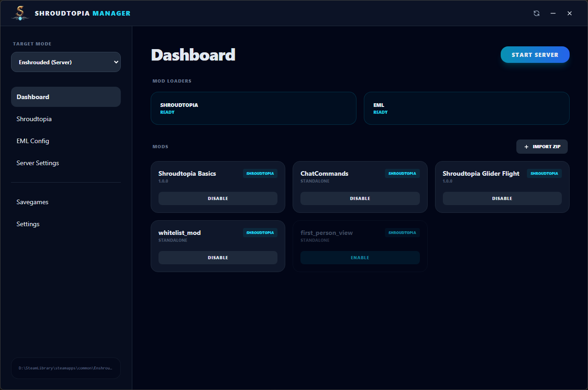

<center>

</center>


**Shroudtopia Manager** is a sleek management solution for **Enshrouded**. Whether you are a player looking for a one-click client setup or a server host needing advanced configurations, Shroudtopia Manager is here to simplify your experience.



[**Download Latest Portable EXE**](https://github.com/s0t7x/shroudtopia-manager/releases)

---

## ✨ Key Features

### 🛠️ Advanced Mod Loading
- **One-Click Installation:** Automatically download and install the latest versions of **Shroudtopia** and **EML (Enshrouded Mod Loader)**.
- **Target Switching:** Seamlessly toggle between your **Game Client** and **Dedicated Server** installations.
- **Auto-Discovery:** Automatically detects Steam installation paths for both the game and the server.

### 📦 Intelligent Mod Management
- **ZIP Import:** Select downloaded Mods ZIP files. The manager automatically detects if a mod needs a subfolder or root extraction based on the internal structure.
- **Active/Inactive Toggling:** Disable and enable mods with one click to troubleshoot or change your setup without deleting files.

### ⚙️ Visual Config Editors
- **Config UI:** Edit `shroudtopia.json`, `eml.json`, and `enshrouded_server.json` using a clean, nested visual interface.
- **Raw JSON Mode:** Switch to a full-featured **Ace Editor** for manual JSON tweaking.

### 🚀 Server Startup
- **Automated Start Script:** Generates a custom PowerShell monitor that handles:
    - **CPU Affinity:** Pin your server to specific cores for better performance.
    - **Process Priority:** Ensure the server gets CPU time (High/RealTime).
    - **Auto-Restart:** Scheduled (configurable) restarts to keep the server fresh.
    - **Crash Recovery:** Automatically restarts the server if it closes or crashes.

---

## 🚀 Quick Start

1. **Download:** Grab the `Shroudtopia-Manager-Portable.exe` from the [Releases](https://github.com/s0t7x/shroudtopia-manager/releases) page.
2. **Setup Paths:** On first launch, verify your Game and Server paths in the **Settings** tab.
3. **Install Loaders:** Go to the Dashboard and click **Install** on the mod loaders you wish to use.
4. **Add Mods:** Use the **Import ZIP** button to add your favorite mods.
5. **Launch:** Click the big **Start** button to begin your journey or spin up your server.

---

## 🛠️ Development

If you want to build the manager from source:

```bash
# Clone the repository
git clone https://github.com/s0t7x/shroudtopia-manager.git

# Install dependencies
npm install

# Run in development mode
npm start
```

---

## 📜 License

Distributed under the MIT License. See `LICENSE` for more information.
